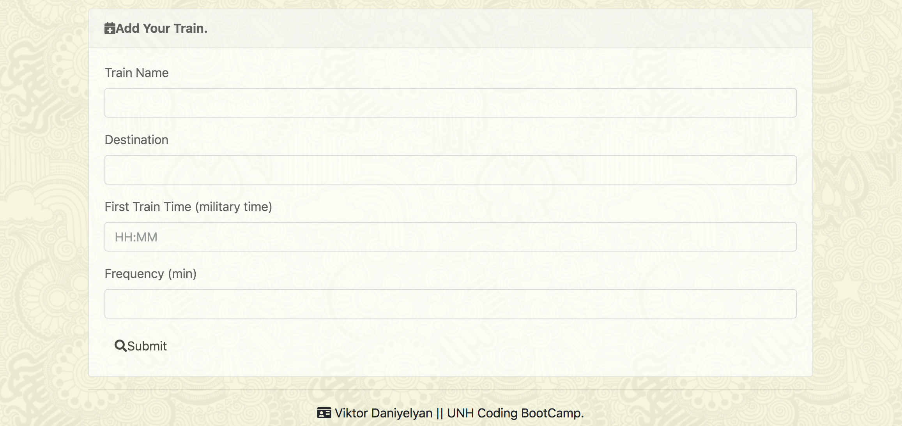

# Train-Scheduler
## Train-Scheduler is a application that allows you to create your own train schedule, and calculate the time of next arrival.

## New technologies used:
* moment.js 
* Firebase database.
# Create your own list of trains: https://vitodaniel.github.io/Train-Scheduler/
